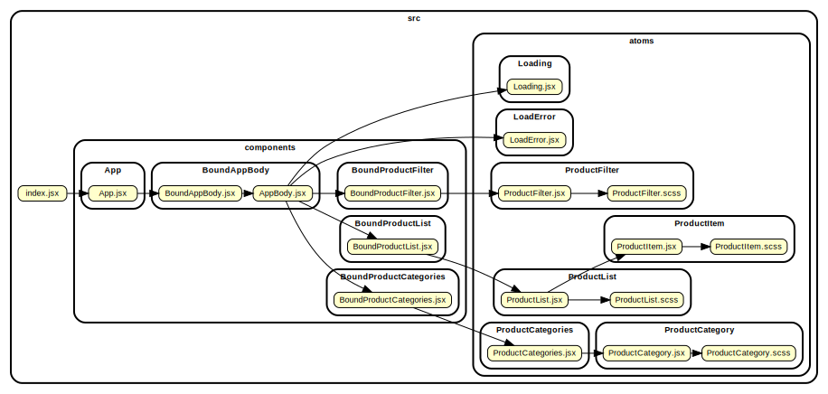
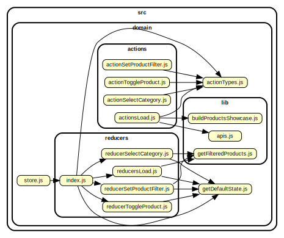
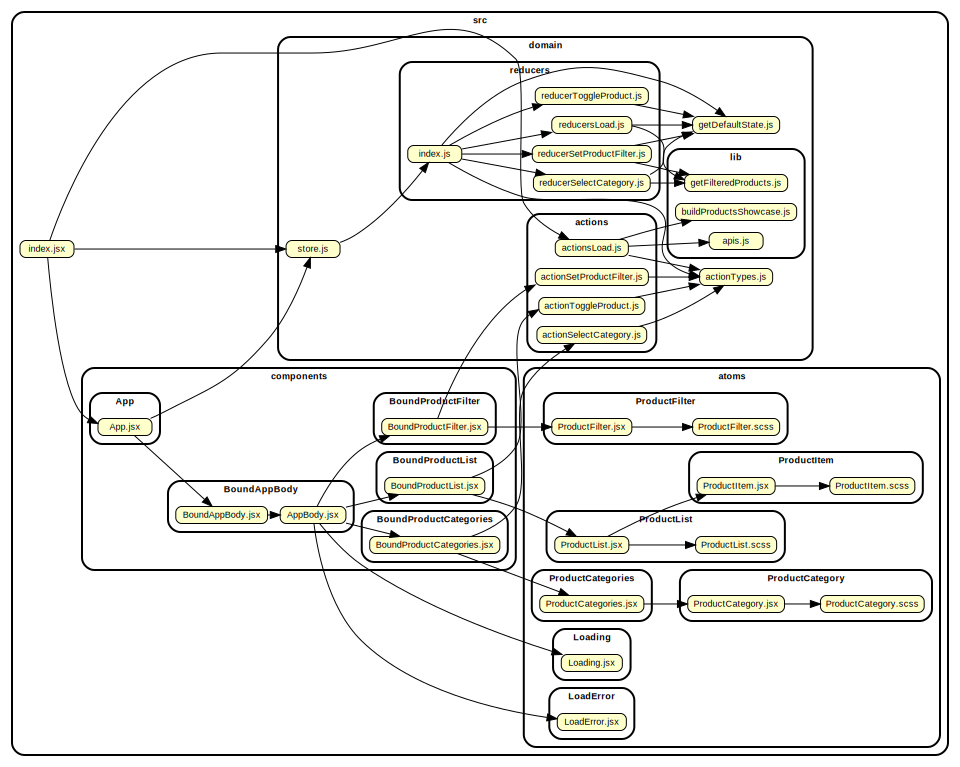

# Tech stack

- The user interface is built in [React 16](https://reactjs.org/).
- The application state is managed through [redux](https://redux.js.org/introduction) and [react-redux](https://github.com/reduxjs/react-redux).
- All modules are written in [JavaScript ES6](https://en.wikipedia.org/wiki/ECMAScript).
- All React components in [JSX](http://facebook.github.io/react/docs/jsx-in-depth.html).
- Style sheets in [SASS](https://sass-lang.com/), with [CSS modules](http://babel-plugin-react-css-modules) support.
- Unit testing in [Jest](https://jestjs.io/) with [enzyme](https://airbnb.io/enzyme/).

### Code style

To maintain the code consistent and clean, [eslint](https://eslint.org/) and [prettier](https://github.com/prettier/prettier) are used.

Eslint often helps to catch bugs and potential errors, forgotten variables or unreachable code while editing.

Prettier, an highly opinionated code formatter, integrates well with all major IDEs. It helps to maintain a consistent code style and to concentrate on the logic of the application and not on the indentation or the code formatting.

### JavaScript

JSX is not supported natively by any browser, it needs to be transpiled to plain JavaScript.
[BabelJS](https://babeljs.io/) is used to transpile from JSX+ES6 to ES5.

The plugin [@babel/preset-env](https://babeljs.io/docs/en/babel-preset-env) is used to automatically select babel options and plugins to compile to the list of browsers specified `.browserslistrc`

ES6 is cleaner, more expressive, less bug prone and less verbose than older version of JavaScript. Is a good practice to write new applications targeting the most recent versions of JavaScript and to transpile for backward compatibility to support older browsers until they don't get slowly retired.

[Cross-fetch](https://www.npmjs.com/package/cross-fetch) and [babel-plugin-transform-runtime](https://babeljs.io/docs/en/babel-plugin-transform-runtime) are used to add the features missing in older browsers javascript runtime libraries.

### Stylesheets

Stylesheets are written in [SASS](https://sass-lang.com/) as isolated [CSS modules](http://babel-plugin-react-css-modules) and transpiled to plain CSS. CSS modules are used to avoid any possible name collision between classes of different components or other libraries. Every React component has its specific and unique CSS classes that will not interfere with anything else.

Would be wise to install and configure [stylelint](https://github.com/stylelint/stylelint) in a bigger project. For the small amount of CSS needed in this project it would be an overkill.

### Webpack

While [ES6 modules](https://developer.mozilla.org/en-US/docs/Web/JavaScript/Reference/Statements/import) and [HTTP/2](https://en.wikipedia.org/wiki/HTTP/2) support is growing, to support older browser and for performance reasons is still convenient to bundle the application in chunks. This application after being transpiled is bundled and minified in a single HTML, single CSS and single JS via [Webpack](https://webpack.js.org/) in the _dist_ folder via the command `npm run build:prod`. One common mistake is to bundle imported libraries (ReactJS for example) together with application code. Is always better to reference common libraries from an external CDN. This reduces compilation time and the bundle size, less data the user have to download, especially considering that the user may have these libraries already cached after visiting other websites. [Dynamic-cdn-webpack-plugin](https://www.npmjs.com/package/dynamic-cdn-webpack-plugin) manages this automatically replacing known node_modules with public CDNs links.

[Webpack-dev-server](https://github.com/webpack/webpack-dev-server) is used for local development. `npm start` will open an HTTP server at [http://localhost:8080](http://localhost:8080), useful to debug the application and see "how things looks" during development. Is always extremely important to setup a working local environment to debug, verify, run manual test, do spikes and experimentation of new features.

Webpack-dev-server, supports a "proxy" feature that is used to redirect APIs call from [http://localhost:8080/products](http://localhost:8080/products) to the remote API server, to skip cross site origin restrictions.

Webpack configuration is in the file _webkack.config.js_

### Testing

[Jest](https://jestjs.io/) is used for unit testing.
Jest, compared to other solutions like Mocha, Ava or Tape, is extremely easy to configure and has almost everything included out of the box. It compiles via babel the referenced modules on the fly. It can be faster than Mocha for large applications by automatically running test suites in parallel on multiple processes. It works very well also with React, JSX and supports [snapshot testing](https://jestjs.io/docs/en/snapshot-testing).

Snapshot testing is extremely useful together with code reviews and pull requests. Since the snapshots are committed together with the code that generates them. is easy to see if any given change in the commit or of the pull request affects some component in unintended ways.

[Enzyme](https://airbnb.io/enzyme/) is used to simulate and render react components in memory (thanks to react virtual DOM). It allows to easily query rendered components features to write test expectations.

[Redux-mock-store](https://github.com/dmitry-zaets/redux-mock-store) is used to mock the redux store for the connected components.

Since this is just a demo application, no integration test or acceptance test were included. For a bigger and more important project would make sense to write both using [puppeteer](https://github.com/GoogleChrome/puppeteer) and [jest-puppeteer](https://github.com/smooth-code/jest-puppeteer).

Compilation, linting, unit test, integration test and acceptance test should all be run by the continuous integration server before being able to merge a pull request to the master branch (gated check-in).

# Project structure

## Atoms and Components (presentation layer)

I decided to divide pure react components, defined as _atoms_, from higher order components connected to the redux store, defined as _components_.
The hard separation used here is mostly for educational purposes, to show in a clearer way how components interact together and how they connect to the redux store.
In a bigger or more practical project this hard division may be less explicit for several components. In any case, is good to consider that components should be reusable and should be able to be used with or without a specific redux store. In bigger projects, some atoms and components may become part of a shared library (for example, an npm package).

I decided to write all components and atoms as pure functional react components, without any internal state. Is always better to centralise the application state management to the redux store and if the application is well designed there are actually few components that would need an internal state.



- Atoms
  - _Loading_ is used to shows a "loading" screen while asynchronously fetching API data.
  - _LoadError_ is sed to show a "loading failed" screen if API calls failed (network error, for example).
  - _ProductFilter_ wraps an input text box to write the filter on the product list.
  - _ProductItem_ is an item in the product list, composed by a clickable header and a long description that can be toggled. This component is used only by _ProductList_.
  - _ProductList_ is a list of ProductItems that supports multiple product selection through a lookup map.
  - _ProductCategory_ an item in the _ProductCategories_ list.
  - _ProductCategories_ is a list of categories that handles selection event and selected.
- Components
  - _BoundProductFilter_ binds a generic ProductFilter atom to the redux store.
  - _BoundProductList_ binds a generic ProductList atom to the redux store.
  - _BoundProductCategories_ binds a generic ProductCategories atom to the redux store.
  - _BoundAppBody_ is the application main page content, it connects all components together and manages the Loading/LoadingError screens.
  - _App_ connects the redux store with BoundAppBody via a react-redux Provider.
  - _index.jsx_ renders App and starts the request to APIs to obtain the list of products and categories.

## Domain (application logic and redux store)

There are several libraries, frameworks or patterns that can be used to maintain the state in a react application. [Flux](https://facebook.github.io/flux/docs/overview.html) and [Redux](https://redux.js.org/introduction), [ModX](https://mobx.js.org/) are some notable examples.
I decided to use redux: it is widely used and well tested, is overall simple to manage and scales well.

In redux, the state is immutable and each state transition requires a new immutable state to be generated.
State transitions are preformed only by reducers, reducers are invoked by loosely coupled actions, this allows redux-react to quickly understand what changed between one state transition to another.
Is always advisable to use a single common central redux store for the whole application.
For bigger projects, [immer](https://github.com/mweststrate/immer) or [immutable-js](https://facebook.github.io/immutable-js/) may be used to manage the state in a simpler way. It would have been an overkill to use these libraries in this small application.

I prefer to split actions and reducers in several files.
This allows the application to scale better than a single big file with all actions and a single file with all reducers. Is also easier to see when a test is missing and avoids big files with thousands of lines.

- _getDefaultState.js_ contains the initial application state
  ```js
  {
    categories: [],         // The list of categories received by APIs
    activeCategory: null,   // The id of the current active category
    productFilter: '',      // The current product filter text
    filteredProducts: [],   // The list of filtered products in the active category
    activeProductsById: {}, // A map that maps product id to a boolean value
    loading: false,         // True while loading from APIs
    loadFailed: false       // True if loading from APIs failed
  }
  ```
- _actionTypes.js_: an "enum" that contains all possible action names.
  - _SELECT_CATEGORY_ to select an active category
  - _TOGGLE_PRODUCT_ to hide or show the description of a single product
  - _SET_PRODUCT_FILTER_ to update the text filter used to filter the products list
  - _LOAD_STARTED_ indicates that the application is loading data from APIs
  - _LOAD_OK_ loading succeeded
  - _LOAD_FAIL_ loading failed
- _actions_: redux actions
  - _actionSetProductFilter_ to update the text filter used to filter the products list
  - _actionToggleProduct_ to hide or show the description of a single product
  - _actionSelectCategory_ to update the text filter used to filter the products list
  - _actionsLoad_
    - _actionLoad_ to fetch the data from api and when completed invokes _actionLoadOk_ or _actionLoadFail_. _actionLoad_ is called just when the application starts.
    - _actionLoadOk_ Called when data from APIs is loaded.
    - \_actionLoadFail: Called when error occurred while fetching API data.
- _reducers_: redux reducers
  - _reducerSelectCategory_ updates the state._activeCategory_
  - _reducersLoad_
    - _reducerLoadStarted_ sets state._loading_ to true
    - _reducerLoadFail_ sets state._loading_ to false and state._loadFailed_ to true
    - _reducerLoadOk_ sets state._categories_ with received data from APIs and refresh the list state._filteredProducts_
  - _reducerSetProductFilter_ updates state._productFilter_ and refresh the list state._filteredProducts_
  - _reducerToggleProduct_ toggles an item in the map of active products state._activeProductsById_
- _lib_: reusable code
  - _buildProductsShowcase.js_ gets the input received from APIs and transform it to a format that can be consumed easily in the application
  - _apis.js_ contains async functions that calls APIs to obtain categories and products
  - _getFilteredProducts.js_ filters a category product list with the given filter text



# Possible improvements

- A code review from another developer.
- More refactoring and cleanup, is always good.
- Continuous Integration with compilation, testing and deploy in a dev environment
- Acceptance test with puppeteer, selenium or nightwatch
- Integration test with puppeteer, selenium or nightwatch
- Move reusable components in a different npm package (with or without a monorepo approach).

# The whole application source code



### Install packages and start the dev server

```sh
npm install
npm start
```

Open the browser to `http://localhost/8080`.
There is no need to install a plugin to disable the cross origin restriction because the APIs are proxied by the development server.

### Unit test

```sh
jest
```

During development, to update the snapshots, run `jest -u`

### JavaScript linter

```sh
npm run lint
```

### Production build

```sh
npm run build:prod
```

Output will be generated in the `dist` folder

### For a list of available commands

```sh
npm run
```
